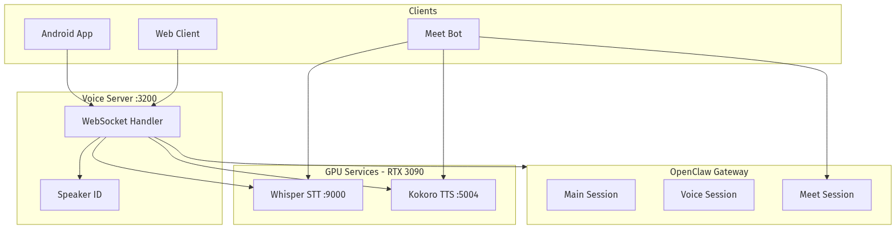
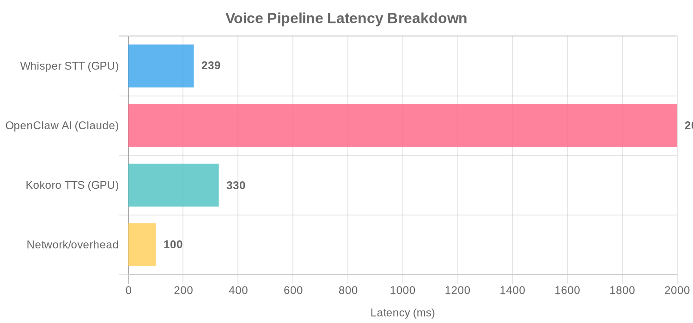
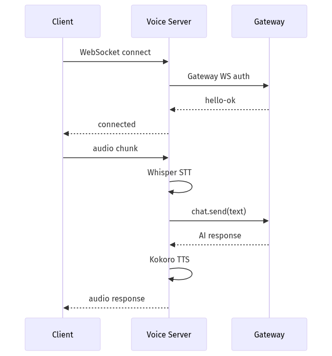
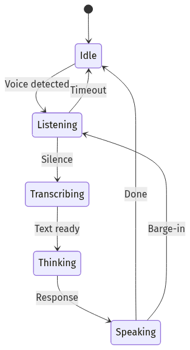
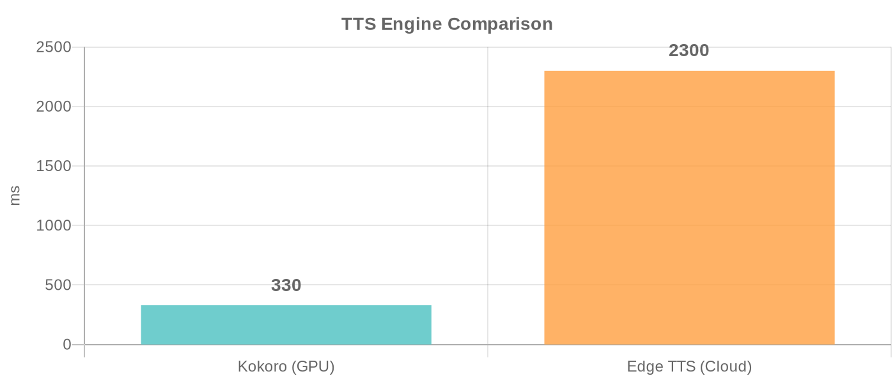
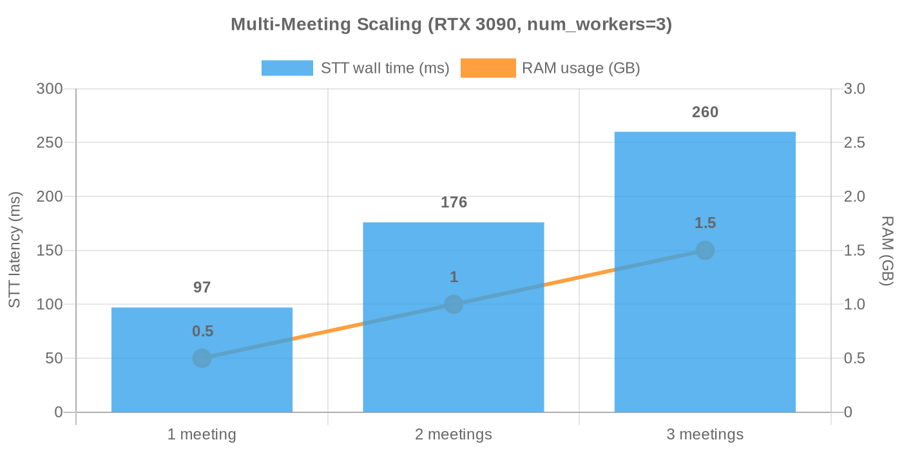

# 🐾 OpenClaw Companion

**Your AI, alive.** Talk to an animated Live2D avatar through voice or text — Android, Web, and Google Meet. Powered by [OpenClaw](https://github.com/openclaw/openclaw).

<p align="center">
  
</p>

> **Self-hosted voice assistant with streaming TTS, speaker identification, emotion-reactive avatars, and Google Meet integration. Deploy on your own hardware with GPU support for fast transcription and local TTS.**

## 📑 Table of Contents

- [✨ Features](#-features)
- [🏗️ Architecture Overview](#-architecture-overview)
- [📦 Services](#-services)
- [🚀 Quick Start](#-quick-start)
- [🤖 Google Meet Bot](#-google-meet-bot)
- [📂 Project Structure](#-project-structure)
- [⚙️ Configuration](#-configuration)
- [🔧 Troubleshooting](#-troubleshooting)
- [📖 Documentation](#-documentation)

## ✨ Features

- **Push-to-talk voice** — hold, speak, release
- **Streaming TTS** — hear the first sentence while the AI is still thinking
- **Emotion-reactive Live2D avatars** — 9 emotions, 7 animated models, emoji bubble reactions
- **Smart Listen mode** — ambient always-on listening with wake word detection
- **Auto noise detection** — quiet/noisy profiles with hysteresis for car mode
- **Speaker identification** — auto-enrolls voices, recognizes who's speaking
- **Google Meet bot** — joins calls with Live2D avatar, speaker detection, transcript batching, meeting memory
- **Bilingual support** — auto-detects language (EN/ES), filters phantom language detections
- **Vision & file analysis** — send images or documents for AI analysis
- **Multiple TTS engines** — Kokoro (local GPU, ~460ms), Edge TTS (cloud, free)
- **Text chat with markdown** — code blocks, inline buttons, artifacts
- **Device capabilities** — system info, GPS, camera, Bluetooth car mic via Android bridge
- **Gateway WS integration** — native WebSocket protocol v3 with streaming + image attachments
- **Custom whisper-fast server** — minimal Python wrapper replacing Speaches' FastAPI (~239ms GPU)
- **Works over Tailscale / LAN / WAN**

## 🏗️ Architecture Overview



### Data Flow


1. **Voice input** → Client records PCM audio → encodes WAV → sends base64 over WebSocket
2. **Transcription** → whisper-fast (faster-whisper) converts speech to text (~239ms GPU)
3. **Speaker ID** → Resemblyzer identifies who's speaking (~10ms)
4. **LLM streaming** → OpenClaw Gateway streams response via WebSocket
5. **Sentence splitting** → Response split at sentence boundaries as tokens arrive
6. **Parallel TTS** → Each sentence sent to Kokoro/Edge TTS immediately
7. **Client playback** → Audio chunks play sequentially while text appears in real-time

### Voice Pipeline Latency



### Connection Protocol



### Client State Machine



## 🚀 Quick Start

### Prerequisites

- ✅ **Docker** with Docker Compose v2
- ✅ **OpenClaw Gateway** running ([setup guide](https://github.com/openclaw/openclaw))
- ⚡ Optional: **NVIDIA GPU** for faster STT (~239ms) and local TTS (~460ms)

### 🎯 Option 1: Interactive Setup (Recommended)

The fastest way to get started with automatic GPU detection:

```bash
git clone https://github.com/marce1994/OpenClaw-Companion.git
cd OpenClaw-Companion
chmod +x setup.sh
./setup.sh
```

The wizard guides you through:
- Configuration (Gateway token, auth secret)
- GPU detection
- `.env` file generation
- Service startup

### 🔧 Option 2: Manual Setup

```bash
git clone https://github.com/marce1994/OpenClaw-Companion.git
cd OpenClaw-Companion

# 1. Configure environment
cp .env.example .env
nano .env  # Set GATEWAY_TOKEN, AUTH_TOKEN, BOT_NAME

# 2. Start services (GPU mode)
docker compose up -d

# OR: CPU-only mode (slower STT/TTS)
docker compose -f docker-compose.cpu.yml up -d
```

### ✅ Verify Services

```bash
# Check status
docker compose ps

# View voice server logs
docker compose logs -f voice-server

# Health check
curl http://localhost:3200/health
```

### 🔗 Connect Your Client

| Client | Setup |
|--------|-------|
| **Android App** | Enter server URL `ws://YOUR_SERVER_IP:3200` + auth token in Settings |
| **Web Client** | `cd web && npm install && npm run dev` |
| **Google Meet Bot** | Enable with `docker compose --profile meet up -d` |

## 📦 Services

### ⚡ Performance Benchmarks

### TTS Engine Comparison



### Multi-Meeting Scaling



### Service Registry

| Service | Port | Description | Required |
|---------|------|-------------|----------|
| `voice-server` | 3200/3443 | WebSocket bridge, TTS, speaker ID | ✅ Yes |
| `whisper-fast` | 9000 | Speech-to-text (custom minimal server + faster-whisper-large-v3-turbo) | ✅ Yes |
| `kokoro-tts` | 5004 | Text-to-speech (GPU, ~330ms) | ✅ Yes (or use Edge TTS) |
| `meet-bot` | 3300 | Google Meet bot with Live2D | Optional |
| `diarizer` | 3202 | Speaker diarization (pyannote) | Optional |
| `summary-worker` | — | Post-meeting summary generation (ephemeral) | Optional |
| `whisperx` | 8088 | WhisperX diarized transcription (ephemeral GPU) | Optional |

Enable optional services with Docker Compose profiles:

```bash
docker compose --profile meet up -d        # Enable Meet bot
docker compose --profile diarizer up -d    # Enable diarizer
```

## 🤖 Google Meet Bot

Joins your Google Meet calls as a participant with an animated Live2D avatar.

```bash
# Enable and start
docker compose --profile meet up -d

# Join a meeting
curl -X POST http://localhost:3300/join \
  -H 'Content-Type: application/json' \
  -d '{"meetLink":"https://meet.google.com/abc-defg-hij"}'
```

Features: Live2D avatar as camera, bilingual EN/ES, calendar auto-join. See [meet-bot/README.md](meet-bot/README.md).

### Meeting Orchestration API

The voice server exposes REST endpoints for managing multiple concurrent Google Meet bot instances:

#### Join a Meeting
```bash
POST /meetings/join
Content-Type: application/json

{
  "meetUrl": "https://meet.google.com/abc-defg-hij",
  "botName": "Jarvis"  # Optional, defaults to config.BOT_NAME
}

Response:
{
  "meetingId": "abc-defg-hij",
  "status": "joining",
  "containerId": "meet-bot-abc-defg-hij",
  "port": 3300
}
```

#### Leave a Meeting
```bash
POST /meetings/leave
Content-Type: application/json

{
  "meetingId": "abc-defg-hij"
}

Response:
{
  "status": "left",
  "meetingId": "abc-defg-hij"
}
```

#### List Active Meetings
```bash
GET /meetings

Response:
{
  "meetings": [
    {
      "meetingId": "abc-defg-hij",
      "meetUrl": "https://meet.google.com/abc-defg-hij",
      "botName": "Jarvis",
      "status": "joined",
      "joinedAt": "2024-02-22T05:30:00Z",
      "port": 3300
    }
  ],
  "total": 1,
  "maxMeetings": 5
}
```

#### Get Meeting Details
```bash
GET /meetings/{meetingId}

Response:
{
  "meetingId": "abc-defg-hij",
  "meetUrl": "https://meet.google.com/abc-defg-hij",
  "botName": "Jarvis",
  "status": "joined",
  "joinedAt": "2024-02-22T05:30:00Z",
  "transcriptEntries": 42,
  "duration": "5m 23s",
  "port": 3300
}
```

**Note:** These endpoints are used internally by OpenClaw Gateway voice commands and Telegram integration. Control meetings naturally via voice ("join the standup") or Telegram chat.

## 📂 Project Structure

```
OpenClaw-Companion/
├── server/                   Voice server (Node.js + Python speaker ID)
│   ├── Dockerfile
│   ├── index.js              WebSocket server, LLM streaming, TTS
│   ├── speaker_service.py    Speaker ID (Resemblyzer) + web search
│   └── start.sh              Entrypoint (starts Python + Node)
├── meet-bot/                 Google Meet bot (Node.js + Puppeteer)
│   ├── Dockerfile
│   └── src/                  Meet joiner, audio pipeline, Live2D
├── diarizer/                 Speaker diarization service (Python)
├── summary-worker/           Post-meeting summary pipeline (ephemeral)
├── whisperx/                 WhisperX diarized transcription API (ephemeral GPU)
├── android/                  Android app (Kotlin + Live2D)
├── web/                      Web client (React + TypeScript + Vite)
├── docker-compose.yml        GPU services (default)
├── docker-compose.cpu.yml    CPU-only services
├── setup.sh                  Interactive setup wizard
└── .env.example              Configuration template
```

## ⚙️ Configuration

All configuration is via environment variables in `.env`. See [`.env.example`](.env.example) for the full list with descriptions.

### Summary Worker Configuration

The summary worker (used for post-meeting processing) requires a config file. Copy the example and fill in your values:

```bash
cp server/summary-config.example.json server/summary-config.json
# Edit with your API keys (OpenRouter, Telegram, HuggingFace)
```

> ⚠️ `server/summary-config.json` contains secrets and is excluded from git via `.gitignore`.

Key variables:

| Variable | Description |
|----------|-------------|
| `GATEWAY_WS_URL` | OpenClaw Gateway WebSocket URL |
| `GATEWAY_TOKEN` | Gateway authentication token |
| `AUTH_TOKEN` | Client ↔ server shared secret |
| `TTS_ENGINE` | `kokoro` (GPU) or `edge` (cloud) |
| `BOT_NAME` | Bot name / wake word |

## 🔧 Troubleshooting

### Services Won't Start

```bash
# Check all service logs
docker compose logs -f

# Check specific service
docker compose logs voice-server
docker compose ps
```

**Common fixes:**
- Verify Docker daemon is running: `docker ps`
- Check port conflicts: `netstat -tuln | grep 3200`
- Increase Docker memory limit (STT needs ~6GB)

### Slow Speech Transcription

⚡ **GPU is not being used**

```bash
# Verify GPU allocation
nvidia-smi

# Check Docker GPU access
docker run --rm --gpus all nvidia/cuda:11.8.0-runtime nvidia-smi
```

**Solution:** Use `docker-compose.yml` (GPU) instead of `docker-compose.cpu.yml`

### No Audio Response

🔇 **TTS engine isn't running**

```bash
# Check Kokoro health
curl http://localhost:5004/health

# View Kokoro logs
docker compose logs kokoro-tts
```

**Solution:** Enable fallback TTS in `.env`

```bash
TTS_ENGINE=edge  # Use cloud-based Edge TTS (slower but reliable)
```

### Can't Connect from Android

📱 **Connection refused / timeout**

```bash
# Verify voice server is accessible
curl http://YOUR_SERVER_IP:3200/health

# Check firewall
sudo ufw allow 3200/tcp
```

**Solutions:**
- Use your **LAN IP** (e.g., `192.168.1.100`), not `localhost`
- For remote access: use **Tailscale** or **WSS with TLS**
- Check that server is listening on all interfaces: `netstat -tuln | grep 3200`

## 📖 Documentation

### Core Documentation

| Doc | Description |
|-----|-------------|
| **[Architecture & Protocol](docs/ARCHITECTURE.md)** | System design, WebSocket protocol spec, data flow diagrams |
| **[Server Configuration](server/README.md)** | Voice server setup, environment variables, speaker ID |
| **[Meet Bot Setup](meet-bot/README.md)** | Google Meet integration, calendar auto-join, Live2D streaming |
| **[Android App](android/README.md)** | Building from source, Live2D integration, device capabilities |
| **[Web Client](web/README.md)** | Web app setup, React components, real-time streaming |

### Quick References

- **Roadmap:** [PLAN.md](PLAN.md) — Current sprints, completed features, backlog
- **Issues?** [Troubleshooting Guide](#-troubleshooting) above
- **Contributing:** Pull requests welcome! Check out open issues

---

## 📊 Performance Metrics

| Component | GPU | CPU | Fallback |
|-----------|-----|-----|----------|
| **Speech Recognition** | 239ms | 2.5s | Whisper model can handle both |
| **Text-to-Speech** | 460ms | N/A | Edge TTS (2.3s, cloud) |
| **Speaker ID** | — | ~100ms | Similarity matching |

All timings measured on NVIDIA RTX 4090 (GPU) and Intel i9 (CPU).

---

## 📄 License

MIT License — See [LICENSE](LICENSE) for details

---

**Made with ❤️ by the OpenClaw community. Deploy it, fork it, make it yours!**
