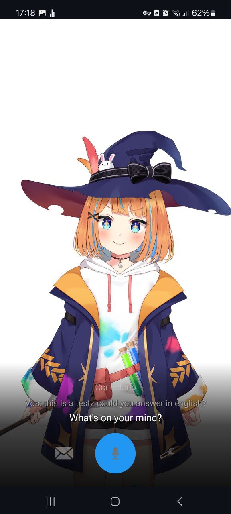

# 🐾 OpenClaw Companion

Your AI, alive. Talk to an animated Live2D avatar through voice or text — Android, Web, and Google Meet. Powered by [OpenClaw](https://github.com/openclaw/openclaw).

<p align="center">
  
</p>

## ✨ Features

- **Push-to-talk voice** — hold, speak, release
- **Streaming TTS** — hear the first sentence while the AI is still thinking
- **Emotion-reactive Live2D avatars** — 9 emotions, 7 animated models, emoji bubble reactions
- **Smart Listen mode** — ambient always-on listening with wake word detection
- **Auto noise detection** — quiet/noisy profiles with hysteresis for car mode
- **Speaker identification** — auto-enrolls voices, recognizes who's speaking
- **Google Meet bot** — joins calls with Live2D avatar, speaker detection, transcript batching, meeting memory
- **Bilingual support** — auto-detects language (EN/ES), filters phantom language detections
- **Vision & file analysis** — send images or documents for AI analysis
- **Multiple TTS engines** — Kokoro (local GPU, ~460ms), Edge TTS (cloud, free)
- **Text chat with markdown** — code blocks, inline buttons, artifacts
- **Device capabilities** — system info, GPS, camera, Bluetooth car mic via Android bridge
- **Gateway WS integration** — native WebSocket protocol v3 with streaming + image attachments
- **Custom whisper-fast server** — minimal Python wrapper replacing Speaches' FastAPI (~239ms GPU)
- **Works over Tailscale / LAN / WAN**

## Architecture

```
┌──────────────┐                              ┌──────────────────────────────────┐
│  Android App │◄──── WebSocket (WS/WSS) ────►│   Voice Server (Node.js)         │
│  or Web App  │   audio/text/images           │   Port 3200 (WS) / 3443 (WSS)   │
└──────────────┘                              │   + Speaker ID (Python :3201)    │
                                              └──────────┬───────────────────────┘
                                                         │
┌──────────────┐                              ┌──────────▼───────────────────────┐
│  Google Meet │◄── Puppeteer + PulseAudio ──►│   Meet Bot (Node.js)             │
│  (browser)   │   audio capture/inject       │   Port 3300 (optional)           │
│              │◄── Live2D canvas stream       └──────────┬───────────────────────┘
└──────────────┘                                         │
                                              ┌──────────▼───────────────────────┐
                                              │   Shared Services                │
                                              │                                  │
                                              │   whisper-fast   (:9000)  ◄─ GPU  │
                                              │   Kokoro TTS    (:5004)  ◄─ GPU  │
                                              │   Diarizer      (:3202)  ◄─ GPU  │
                                              │   OpenClaw Gateway               │
                                              └──────────────────────────────────┘
```

### Data Flow

1. **Voice input** → Client records PCM audio → encodes WAV → sends base64 over WebSocket
2. **Transcription** → Speaches (faster-whisper) converts speech to text
3. **Speaker ID** → Resemblyzer identifies who's speaking
4. **LLM streaming** → OpenClaw Gateway streams response via WebSocket
5. **Sentence splitting** → Response split at sentence boundaries as tokens arrive
6. **Parallel TTS** → Each sentence sent to Kokoro/Edge TTS immediately
7. **Client playback** → Audio chunks play sequentially while text appears in real-time

## 🚀 Quick Start

### Prerequisites

- **Docker** with Docker Compose v2
- **OpenClaw Gateway** running ([setup guide](https://github.com/openclaw/openclaw))
- Optional: **NVIDIA GPU** for faster STT and local TTS

### Option 1: Interactive Setup (Recommended)

```bash
git clone https://github.com/openclaw/OpenClaw-Companion.git
cd OpenClaw-Companion
chmod +x setup.sh
./setup.sh
```

The wizard will guide you through configuration, detect GPU, generate `.env`, and start services.

### Option 2: Manual Setup

```bash
git clone https://github.com/openclaw/OpenClaw-Companion.git
cd OpenClaw-Companion

# Configure
cp .env.example .env
nano .env  # Set GATEWAY_TOKEN, AUTH_TOKEN, etc.

# GPU mode (default)
docker compose up -d

# OR CPU-only mode
docker compose -f docker-compose.cpu.yml up -d
```

### Verify It's Running

```bash
docker compose ps                    # Check service status
docker compose logs -f voice-server  # Voice server logs
curl http://localhost:3200/health    # Health check
```

### Connect a Client

- **Android app**: Enter `ws://YOUR_SERVER_IP:3200` and your auth token in Settings
- **Web app**: `cd web && npm install && npm run dev`

## 📦 Services

| Service | Port | Description | Required |
|---------|------|-------------|----------|
| `voice-server` | 3200/3443 | WebSocket bridge, TTS, speaker ID | ✅ Yes |
| `whisper-fast` | 9000 | Speech-to-text (custom minimal server + faster-whisper-large-v3-turbo) | ✅ Yes |
| `kokoro-tts` | 5004 | Text-to-speech (GPU, ~330ms) | ✅ Yes (or use Edge TTS) |
| `meet-bot` | 3300 | Google Meet bot with Live2D | Optional |
| `diarizer` | 3202 | Speaker diarization (pyannote) | Optional |

Enable optional services with Docker Compose profiles:

```bash
docker compose --profile meet up -d        # Enable Meet bot
docker compose --profile diarizer up -d    # Enable diarizer
```

## 🤖 Google Meet Bot

Joins your Google Meet calls as a participant with an animated Live2D avatar.

```bash
# Enable and start
docker compose --profile meet up -d

# Join a meeting
curl -X POST http://localhost:3300/join \
  -H 'Content-Type: application/json' \
  -d '{"meetLink":"https://meet.google.com/abc-defg-hij"}'
```

Features: Live2D avatar as camera, bilingual EN/ES, calendar auto-join. See [meet-bot/README.md](meet-bot/README.md).

## 📂 Project Structure

```
OpenClaw-Companion/
├── server/                   Voice server (Node.js + Python speaker ID)
│   ├── Dockerfile
│   ├── index.js              WebSocket server, LLM streaming, TTS
│   ├── speaker_service.py    Speaker ID (Resemblyzer) + web search
│   └── start.sh              Entrypoint (starts Python + Node)
├── meet-bot/                 Google Meet bot (Node.js + Puppeteer)
│   ├── Dockerfile
│   └── src/                  Meet joiner, audio pipeline, Live2D
├── diarizer/                 Speaker diarization service (Python)
├── android/                  Android app (Kotlin + Live2D)
├── web/                      Web client (React + TypeScript + Vite)
├── docker-compose.yml        GPU services (default)
├── docker-compose.cpu.yml    CPU-only services
├── setup.sh                  Interactive setup wizard
└── .env.example              Configuration template
```

## ⚙️ Configuration

All configuration is via environment variables in `.env`. See [`.env.example`](.env.example) for the full list with descriptions.

Key variables:

| Variable | Description |
|----------|-------------|
| `GATEWAY_WS_URL` | OpenClaw Gateway WebSocket URL |
| `GATEWAY_TOKEN` | Gateway authentication token |
| `AUTH_TOKEN` | Client ↔ server shared secret |
| `TTS_ENGINE` | `kokoro` (GPU) or `edge` (cloud) |
| `BOT_NAME` | Bot name / wake word |

## 🔧 Troubleshooting

**Services won't start?**
```bash
docker compose logs -f          # Check all logs
docker compose ps               # Check status
```

**Whisper is slow?**
- Make sure you're using the GPU compose file
- Check GPU allocation: `nvidia-smi`

**No audio response?**
- Verify Kokoro is running: `curl http://localhost:5004/health`
- Try Edge TTS fallback: set `TTS_ENGINE=edge` in `.env`

**Can't connect from Android?**
- Use your machine's LAN IP, not `localhost`
- Check firewall allows port 3200
- For remote access, use Tailscale or set up WSS with TLS

## 📖 More Documentation

- [Architecture & Protocol](docs/ARCHITECTURE.md) — full WebSocket protocol spec
- [Server README](server/README.md) — detailed server configuration
- [Meet Bot README](meet-bot/README.md) — Meet bot setup
- [Android README](android/README.md) — building the Android app
- [Web README](web/README.md) — web client setup

## 📄 License

[MIT](LICENSE)
